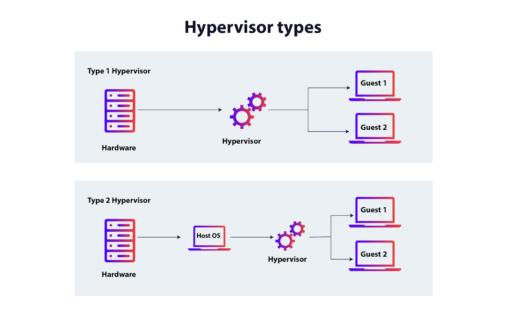

# Containers vs Virtual Machines

---
By the end this guide, a beginner will able to:

- Understand why environment inconsistency happens
- Explain what Virtual Machine is
- Expalin what a Containe is
- Describe the architectural difference between them
- Understand why containers became dominant in modern systems

This is a mental model guide.

---

## The Core Problem
Have you ever heard:

> "It works on my machine." 

Why does that happen?

Because software depends on:
- Operating System
- Instlled libraries
- System configurations
- Environment variables
- Dependency versions

If any of these differ - the application may break. 💔

We needed a way to package applications so they behave consistently everywhere.

Two major solutions emerged:
- Virtual Machines
- Containers

---

## What is a Virtual Machine?

A Virtual Machine (VM) virtualizes **hardware**.

It allows multiple operating systems to run on the same physical machine.

### Architecture
Hardware 
 -> Hypervisor [Learn More](https://www.dnsstuff.com/what-is-hypervisor)
 -> Guest OS
 -> Application
 -> 

Each VM:
- Has its own full operating system.
- Has its own kernel
- Consumes significant memory
- Takes time to boot

### Key Idea

A VM simulates an entire computer.

---

## 📦 What is a Container?

A Container virtualizes the **operating system**, not the hardware.

Containers share the host OS kernel but isolate processes.

### Architecture

Hardware
 -> Host OS 
 -> Container Runtime
 -> Application + Dependencies

Each container:
- Shares the same kernel
- Is lightweight
- Starts in seconds
- Uses fewer resources

### Key Idea

A contianer isolates processes - not hardware.

---

## Side-by-Side Comparison

|     Feature      | Virtual Machine | Container     |
|------------------|-----------------|---------------|
| Virtualize       | Hardware        | OS            | 
| OS per app       | Yes             | No            |
| Kernel Per app   | Yes             | Shared        |
| Memory usage     | High            | Low           |
| Startup time     | Slow            | Fast          |
| Isolation level  | Strong          | Process-level |

---

## What Makes Containers Possible?

Containers rely heavily on Linux kernel features:

- Namespaces -> Process isolation
- cgroups -> Resource contorl
- Union file systems -> Efficient layering

Without the Linux kernel, modern containers would not exist.

This is Why Linux knowledge is foundational in cloud-native system.

---

## Real-World Scenario

Imagine deploying 20 microservices.

### Using VM:
- 20 separate OS instances
- High memory usage
- Slow scaling

### Using Containers:
- 1 OS
- 20 Isolated processes
- Efficient resource sharing
- Fast scaling

This is why containers became the backbone of cloud infrastructure.

---

## Where Do Docker 🐳 and Kubernetes 🕸 Fit?

- Docker -> Builds and runs containers
- Kubernetes -> Manages containers at scale

Containers solved packaging.
Kubernetes solved orchestration.

---

### When Should You Use VMs?

- Strong isolation is requried
- Different OS types are needed
- Running legacy enterprise systems
- Multi-tenant infrastructure environments

They are just heavier.

---

## Summary

Virtual Machines simulate entire computers.
Containers isolate applications using the host OS.

## Reflection

Technology evolves.
Abstractions change.
But the core question always remains:

What layer are we virtualizing?